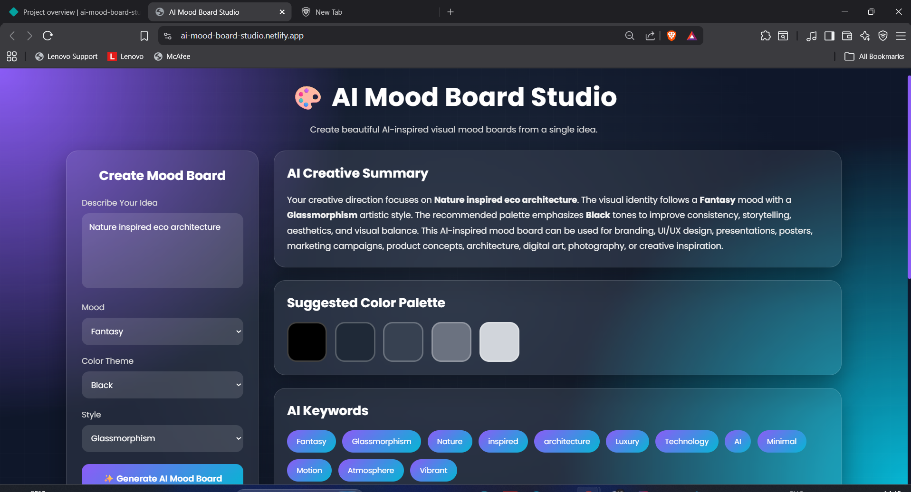
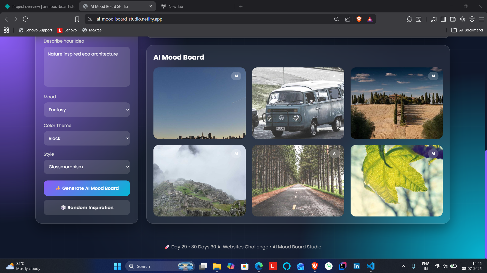

# 🎨 AI Mood Board Studio

## 🚀 Day 29 of my 30 Days 30 AI Websites Challenge

AI Mood Board Studio is an AI-inspired web application designed to help users transform creative ideas into beautiful visual mood boards.

Instead of simply displaying images, the platform simulates how AI could assist designers by generating a creative summary, suggesting visual styles, recommending color palettes, creating design keywords, and assembling an inspiring mood board from a single idea.

Whether you're brainstorming a branding project, designing a user interface, planning digital artwork, or seeking creative inspiration, AI Mood Board Studio demonstrates how AI can enhance the early stages of the creative design process.

---

## 🌐 Live Demo

https://ai-mood-board-studio.netlify.app/

---

## 📸 Screenshots

---

## ✨ Features

* AI-Inspired Mood Board Generator
* Creative Idea Analyzer
* AI Creative Summary
* Dynamic Color Palette Suggestions
* Smart Design Keywords
* Interactive Mood Board Gallery
* Random Inspiration Generator
* Modern Glassmorphism UI
* Fully Responsive Design
* Smooth User Experience

---

## 📋 How It Works

1. Open AI Mood Board Studio.
2. Enter your creative idea or project concept.
3. Choose a mood, color theme, and design style.
4. Click **Generate AI Mood Board**.
5. Explore the AI-generated creative summary.
6. View the recommended color palette.
7. Discover design keywords and visual inspiration.
8. Generate new ideas using the Random Inspiration feature.

---

## 🛠️ Technologies Used

* HTML
* CSS
* JavaScript
* Built with the help of AI-assisted development tools

---

## 🎯 Challenge Progress

✅ Day 29 Completed — AI Mood Board Studio

Part of my **30 Days 30 AI Websites Challenge**, where I build and publish one AI-powered web project every day to improve my frontend development, product-building, UI/UX design, and problem-solving skills.

---

## 👨‍💻 Author

**Bettam Anand**

**B.Tech CSE(Data Science)**

JNTUH University College of Engineering Palair
